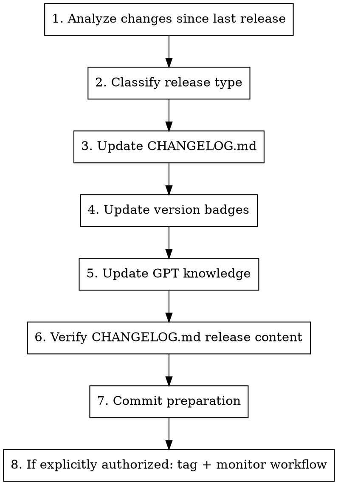

# Prepare Release

## Overview

Prepare a new release by generating changelog entries, updating version references, and creating release notes.

## Usage

```
/prepare-release
```

## Release Authority and Automation

**Do not create release tags just because this skill was invoked.** By default, prepare only.

When Karim explicitly says to do the release (for example "release time" or "do the release"), run the full local release gates, create and push the annotated tag yourself, then confirm the lightweight publication workflow.

Default job:
- Prepare the changelog
- Update version references
- Generate release notes draft
- Commit preparation changes

Maintainer-authorized release job:
- Verify `master` is clean and up to date
- Verify the release tag does not already exist locally or remotely
- Create and push the annotated tag
- Let `.github/workflows/publish-release.yaml` publish the already-verified tag
- Confirm the workflow and GitHub release succeeded

## Current Release Automation

The repository has tag-driven release automation in `.github/workflows/publish-release.yaml`.

Important details:
- The workflow runs only on pushed `v*` tags and has no manual-dispatch path.
- It extracts the Markdown release content from `CHANGELOG.md`, specifically everything under `## [Unreleased]` until the next `## [` heading.
- It rejects a missing, duplicate, or empty `[Unreleased]` section.
- It asks GitHub to append generated release notes.
- It creates the GitHub release with `ncipollo/release-action`.
- It does not run Terraform, Packer, HCloud, bootstrap, or cluster gates. Those
  are authoritative local pre-tag checks.

Therefore:
- `CHANGELOG.md` is the release-content Markdown file.
- Keep the target release notes under `## [Unreleased]` until after the release tag is pushed.
- Do not move `[Unreleased]` to `[vX.Y.Z] - YYYY-MM-DD` before tagging unless you are also bypassing the workflow and manually providing release notes.
- Do not run `gh release create` during the normal path; the tag workflow owns publication. Use it only after re-running the local integrity gates if publication fails.
- If Karim asks for a tiny release-prep correction during release, commit it on the release branch, merge it through the protected `master` pull-request path, then tag the resulting merged commit.
- After a successful release, cut `CHANGELOG.md`: reset `## [Unreleased]` to an empty placeholder and move the released notes under `## [X.Y.Z] - YYYY-MM-DD`. Merge that cleanup through a release-maintenance pull request.
- Previous release notes must never remain under `## [Unreleased]`; otherwise the next tag workflow will publish stale notes again.
- For v3-series releases, verify README's compact "Current release:" link points
  at the latest release tag and `CHANGELOG.md` carries the release content.
- After significant releases, regenerate the machine-readable knowledge file
  (`kube-hetzner-knowledge.jsondata`) and confirm its `meta.version` matches
  the release. The Custom GPT was retired 2026-07-13 — the agent skills
  (installed via `npx skills add kube-hetzner/terraform-hcloud-kube-hetzner`)
  are the assistant channel; the knowledge file feeds future tooling (MCP).

## Contributor Credit (SUPER IMPORTANT)

GitHub-generated notes and the changelog expose the people whose work landed since the previous tag. Original PR submitters MUST remain visible — credit where credit is due.

- Upstream requirement (enforced at merge time, see the `review-pr` skill): merge every accepted community PR's exact head into our isolated integration worktree first, then add maintainer adaptations in separate commits. Promote with merge commits, never squash or rebase, so original authorship and PR identity survive. Partial adoption or porting follows the skill's explicit credit and honest-closure rules.
- Promotion or major integration PRs, such as the v3 staging-to-master train,
  must merge with a merge commit. Never squash those PRs; squashing erases the
  per-commit community authors that feed repository and release credit.
- Pre-tag check: `git log <prev-tag>..HEAD --format='%an <%ae>' | sort -u` — every community contributor whose fix is in the release must be listed. If someone is missing, fix history/credit BEFORE tagging (after tagging it is public and immutable).
- Pre-tag disposition check: every fully accepted community PR must have a non-null `mergedAt`. For PRs integrated indirectly through a release branch, also verify the recorded `headRefOid` is an ancestor of the release target. A closed-but-unmerged accepted PR is a release-process defect; repair the integration before tagging instead of compensating with comments.
- Pre-tag review check: inspect automated Codex reviews and threads for each original and integration PR, action every finding, and verify the final-head disposition using `review-pr`. Green CI does not substitute for reading review feedback.
- Post-release check: generated notes and changelog thanks must include the original submitters, not just maintainers. If someone is missing, treat it as a release defect and edit the release body.
- Changelog entries for community fixes reference their PR/issue numbers so the human credit is also visible in prose.

## Workflow



## Step 1: Analyze Changes

```bash
REPO=$(gh repo view --json nameWithOwner --jq .nameWithOwner)

# Get latest release tag
LATEST=$(gh release list --repo "$REPO" --limit 1 --json tagName --jq '.[0].tagName')
echo "Latest release: $LATEST"

# List commits since last release
git log $LATEST..HEAD --oneline

# Get detailed changes
git log $LATEST..HEAD --pretty=format:"- %s (%h)"
```

Read the commit list and diff directly. Trace user-facing changes to their
changelog entries and classify them as features, bug fixes, breaking changes,
or documentation. Ignore internal refactors unless they alter behavior.

## Step 2: Classify Release Type

| Type | When | Example |
|------|------|---------|
| **PATCH** (x.x.X) | Bug fixes, docs, deps | 2.19.1 |
| **MINOR** (x.X.0) | New features, backward compatible | 2.20.0 |
| **MAJOR** (X.0.0) | Breaking changes | 3.0.0 |

### Breaking Change Indicators
- Variable removed or renamed
- Default value changes behavior
- Resource naming changes (causes recreation)
- Required migration steps

Obtain the mandatory independent review of breaking-change and resource-
recreation risk. Give the reviewer the exact release diff and require a final
verdict with concrete file and line references; verify every finding against
the code and upgrade-plan evidence.

## Step 3: Update CHANGELOG.md

### Changelog Format

```markdown
## [Unreleased]

### ⚠️ Upgrade Notes
<!-- Migration guides, breaking change warnings, special upgrade steps -->

### 🚀 New Features
<!-- New functionality added -->

### 🐛 Bug Fixes
<!-- Bugs that were fixed -->

### 🔧 Changes
<!-- Non-breaking changes, refactors, improvements -->

### 📚 Documentation
<!-- Documentation updates -->
```

### Writing Good Entries

- Write from user's perspective
- Include issue/PR references: `(#1234)`
- Be specific about what changed
- Include migration steps for breaking changes

### Example Entries

```markdown
### 🚀 New Features
- **K3s v1.35 Support** - Added support for k3s v1.35 channel (#2029)
- **NAT Router IPv6** - NAT router now supports IPv6 egress (#2015)

### 🐛 Bug Fixes
- Fixed autoscaler not respecting max_nodes limit (#2018)
- Resolved firewall rules not applying to new nodes (#2012)

### ⚠️ Upgrade Notes
- **NAT Router users**: Run `terraform apply` twice after upgrade due to route changes
```

## Step 4: Update Version Badges

Update README.md badges if version references changed:

```markdown
[](https://k3s.io)
```

Check `versions.tf` for:
- Terraform version requirement
- Provider version requirements
- K3s default channel

## Step 5: Update Knowledge File (if applicable)

If significant changes, regenerate the machine-readable knowledge file
(Custom GPT retired 2026-07-13; this feeds future tooling such as the planned
MCP server):

1. Use the maintained knowledge-generation workflow/artifact for this repo or
   operator environment.
2. Update the generated file's `meta.version` to the release being prepared.
3. Re-open the generated artifact and verify the version plus the release's
   major operational facts.

Do not invent a checked-in generator path if one is not present in the worktree.

## Step 6: Verify Release Notes Content

Normal path: the release notes draft is the `CHANGELOG.md` content under `## [Unreleased]`. Make sure it contains the target release section, issue/PR references, upgrade notes if any, and no stale placeholder text.

Preview exactly what the workflow will extract:

```bash
awk '/^## \[Unreleased\]/{flag=1; next} /^## \[/{flag=0} flag' CHANGELOG.md
```

If a separate release-notes file exists in a future train, use it as a drafting aid, but copy the final release content into `CHANGELOG.md` under `## [Unreleased]` before tagging so the automation can consume it.

Before tagging a v3 release, run the local readiness gates:

```bash
terraform fmt -recursive
terraform-docs markdown table --config .terraform-docs.yml --output-mode inject --output-file docs/terraform.md .
terraform init -backend=false -input=false
terraform validate -no-color
tmpdir="$(mktemp -d)"
rsync -a --exclude .git --exclude .terraform --exclude .terraform-tofu ./ "$tmpdir"/
(cd "$tmpdir" && tofu init -backend=false -input=false && tofu validate -no-color)
rm -rf "$tmpdir"
uv run scripts/validate_tailscale_large_scale_examples.py
uv run scripts/validate_v3_final_polish_examples.py
uv run scripts/smoke_v3_plan_matrix.py
scripts/tests/test_github_release_controls_contract.sh
scripts/check-github-release-controls.sh
scripts/tests/test_create_distribution.sh
scripts/tests/test_generated_site_contract.sh
```

The GitHub control check is a live, authenticated pre-release gate. It verifies
that the default branch requires pull requests plus the cheap lint check and
blocks force-push/deletion, `v*` tags have an active creation/update/deletion/
non-fast-forward ruleset, and no GitHub-hosted HCloud environment remains. A
repository fixture cannot substitute for these live settings.

Keep setup simple: the README exposes the canonical `createkh` one-liners while
`scripts/create.sh` owns source distribution, manifest verification, and atomic
Packer bundle publication. Test the downloaded-script path and the checked-out
source path before release. A specific release can be selected with
`KH_SOURCE_REF=vX.Y.Z`. Exceptional independently verified remote builds must
set all three strict pins together: `KH_SOURCE_COMMIT` (full 40-character SHA),
`KH_SOURCE_ARCHIVE_SHA256`, and `KH_PACKER_BUNDLE_MANIFEST_SHA256`. Strict pins
cannot be combined with `KH_SOURCE_DIRECTORY` and are not part of normal release
choreography.

Cross-variable and local-dependent module contract failures are hard
`terraform_data.validation_contract` preconditions, so invalid-combination
release gates must assert `terraform plan`; `terraform validate` only proves
the module loads.

Also verify `README.md`, `kube.tf.example`, `docs/llms.md`, and `.claude/skills/*/SKILL.md` do not contain removed v2 input names except in explicit migration sections.

For v3 releases, verify README's compact "Current release:" URL points to the
latest tag and `CHANGELOG.md` carries the release content without stale
pre-release wording. Regenerate `site-docs` and run
`scripts/tests/test_generated_site_contract.sh`; the site must reproduce the
same simple setup commands as the README.

For v3, additionally verify the Tailscale node-transport surfaces stay aligned:
`node_transport_mode = "tailscale"` is the supported secure single-network and
private multinetwork path, Flannel is first supported, Cilium is experimental,
Calico is rejected, subnet-route SNAT is disabled when advertising routes,
single-network examples may disable node-private route advertisement, and
active Tailscale agent/autoscaler nodepools set `network_scope` explicitly so
same-root external Network IDs are validated during `terraform plan`,
external-overlay docs still describe only user-owned operator
access/post-bootstrap features.

Also verify the final v3 topology polish surfaces stay aligned:
`docs/v3-topology-recommendations.md`, `examples/cilium-gateway-api`,
`examples/external-overlay-cloudflare-access`, `cilium_gateway_api_enabled`,
`embedded_registry_mirror`, endpoint outputs,
public join endpoint IPv6/no-public-host guards, OpenTofu/null-resource gates,
and the large-scale Tailscale examples must all match `variables.tf`,
`locals.tf`, `kube.tf.example`, and `docs/llms.md`.

For Cloudflare, keep the release support boundary sharp: Access/Tunnel is a
documented external access pattern for operator/app endpoints; kube-hetzner does
not manage Cloudflare provider resources, and Cloudflare Mesh/WARP is not a v3
node-transport support promise.

For the required cheap PR lint, require a completed success. GitHub Actions do
not run HCloud plans, applies, cluster inspection, or destroy. Run those gates
locally from the maintained kube-test roots and retain their logs before tag
publication.

### Release Notes Template

```markdown
## 🚀 Release vX.Y.Z

### Highlights

- **Feature 1**: Brief description
- **Feature 2**: Brief description

### ⚠️ Upgrade Notes

[Any special upgrade instructions]

### What's Changed

#### New Features
- Feature description (#PR)

#### Bug Fixes
- Fix description (#PR)

#### Other Changes
- Change description (#PR)

### Full Changelog

https://github.com/kube-hetzner/terraform-hcloud-kube-hetzner/compare/vPREV...vX.Y.Z

### Upgrade

\`\`\`tf
module "kube-hetzner" {
  source  = "kube-hetzner/kube-hetzner/hcloud"
  version = "X.Y.Z"
  # ...
}
\`\`\`

\`\`\`bash
terraform init -upgrade
terraform plan
terraform apply
\`\`\`
```

## Step 7: Commit Preparation

```bash
git status --short
git add CHANGELOG.md README.md docs/llms.md docs/terraform.md kube.tf.example .claude/skills
git commit -m "$(cat <<'EOF'
chore: prepare release vX.Y.Z

- Update release notes and version references
EOF
)"
git push origin HEAD
gh pr create --base master --head "$(git branch --show-current)" --fill
```

Release preparation and post-release cleanup always use pull requests because
`master` protection applies to administrators. Never bypass or temporarily
weaken that protection for a release.

## Execute Release (Only When Karim Explicitly Authorizes)

```bash
VERSION=vX.Y.Z
REPO=$(gh repo view --json nameWithOwner --jq .nameWithOwner)

git checkout master
git fetch --no-tags origin master
git merge --ff-only refs/remotes/origin/master
test -z "$(git status --porcelain)"
RELEASE_COMMIT=$(git rev-parse HEAD)

# Refuse to continue if either command prints the tag.
git tag --list "$VERSION"
git ls-remote --tags origin "refs/tags/$VERSION"

# Immediately before tagging, re-prove live controls and refresh the authoritative
# branch. The atomic push lease prevents the tag from publishing if master moves
# after this fetch.
test -z "$(git status --porcelain)"
scripts/check-github-release-controls.sh
git fetch --no-tags origin master
scripts/check-release-ref-on-remote-default-branch.sh --require-tip "$RELEASE_COMMIT" refs/remotes/origin/master
test "$(git rev-parse HEAD)" = "$RELEASE_COMMIT"

# Create and atomically push the tag with the unchanged protected-master tip.
# If this push fails, no remote tag is created; delete the local tag before retrying.
git tag -a "$VERSION" "$RELEASE_COMMIT" -m "Release $VERSION"
git push --atomic --force-with-lease="refs/heads/master:$RELEASE_COMMIT" origin \
  "${RELEASE_COMMIT}:refs/heads/master" "refs/tags/$VERSION"

# Confirm the lightweight publication workflow and release.
gh run list --repo "$REPO" --workflow "Publish a new Github Release" --limit 1
gh release view "$VERSION" --repo "$REPO"
```

If publication fails, do not move the immutable tag. Re-run all local release
gates against the tag target, including create distribution, generated docs,
the authoritative remote-branch check, and live GitHub controls. Regenerate the
exact release body from that tag's `[Unreleased]` section, confirm no partial
release exists, then use
`gh release create "$VERSION" --title "$VERSION" --notes-file <file> --generate-notes`.

A pushed release tag is immutable. If the workflow definition at that tag has a
permanent defect, do not move or recreate the tag: manually create the release
from that tag's reviewed release content only after the local gates above,
verify the public body and tag target, then repair the cheap publication
workflow through a post-release pull request.

## Post-Release Verification

```bash
VERSION=vX.Y.Z
REPO=$(gh repo view --json nameWithOwner --jq .nameWithOwner)

gh release view "$VERSION" --repo "$REPO" --json tagName,name,isPrerelease,publishedAt,url,targetCommitish
gh release list --repo "$REPO" --limit 3
git ls-remote --tags origin "refs/tags/$VERSION"
```

Inspect the live release notes, not just the workflow status:

```bash
gh release view "$VERSION" --repo "$REPO" --json body --jq .body
```

If the body contains stale content from older releases, edit the GitHub release directly with a corrected body and then fix `CHANGELOG.md` on `master` so the same mistake does not recur.

If creating or updating a pinned upgrade notice issue after release, write it for the full practical upgrade path users need, not just the latest patch delta. For example, after a `v2.19.x` patch, the pinned notice should cover upgrading from `v2.18.x` to the current `v2.19.x`, including older release caveats such as state migration instructions, version requirements, and plan-review warnings.

After confirming the live release, cut the changelog:

```markdown
## [Unreleased]

_No unreleased changes._

---

## [X.Y.Z] - YYYY-MM-DD

...released notes...
```

Create a release-maintenance branch for the changelog cut, push it, and merge
it through a pull request with the same protected-`master` review flow.

## Version Reference Locations

Files that may need version updates:

| File | What to Update |
|------|---------------|
| `README.md` | Badge versions |
| `CHANGELOG.md` | Release content must stay under `[Unreleased]` until tag publication runs |
| `docs/llms.md` | Example version references |
| `kube.tf.example` | Version in comments |
| `docs/v2-to-v3-migration.md` | Target module version in the migration example |
| `.claude/skills/kh-assistant/SKILL.md` | Checked-in current release baseline (still verify live at startup) |
| `.claude/skills/*/SKILL.md` | Operator workflows, v3 migration names, validation gates |
| GPT knowledge | meta.version |

## Quick Checklist

- [ ] Commits analyzed since last release
- [ ] Contributor credit verified: `git log <prev-tag>..HEAD --format='%an <%ae>' | sort -u` includes every community submitter whose work ships in this release
- [ ] Every fully accepted community PR shows `mergedAt`; indirectly integrated PR heads are ancestral to the release target
- [ ] Release type determined (PATCH/MINOR/MAJOR)
- [ ] CHANGELOG.md updated
- [ ] Breaking changes documented with migration steps
- [ ] Version badges updated (if needed)
- [ ] `docs/terraform.md` regenerated
- [ ] README "Current release:" URL is accurate/current for v3-series releases
- [ ] Generated site carries the same simple `createkh` setup commands as README
- [ ] Knowledge file (`kube-hetzner-knowledge.jsondata`) regenerated when applicable and `meta.version` matches the release
- [ ] Project skills checked for stale v2 names
- [ ] Tailscale node-transport README/example/skill guidance matches variables.tf
- [ ] Cloudflare Access/Tunnel docs/examples say external-only, and no Cloudflare Mesh/WARP node-transport promise exists
- [ ] v3 topology chooser, Cilium Gateway API, embedded registry mirror, and endpoint outputs are documented
- [ ] `uv run scripts/validate_v3_final_polish_examples.py` passed
- [ ] `uv run scripts/smoke_v3_plan_matrix.py` passed for Gateway API, registry mirror, public join endpoint guards, k3s/RKE2 Tailscale multinetwork constraints, and single-Gateway-controller validation
- [ ] Terraform and OpenTofu validation passed
- [ ] `scripts/tests/test_create_distribution.sh` passed for local and downloaded-script source modes
- [ ] Adversarial and live GitHub release-control gates passed
- [ ] Required cheap PR lint has a completed successful run
- [ ] HCloud plan/apply, cluster inspection, and destroy evidence was produced locally
- [ ] Release notes drafted
- [ ] Changes committed and pushed
- [ ] If explicitly authorized, tag pushed
- [ ] Release workflow succeeded
- [ ] GitHub release exists and points at the intended commit
- [ ] Live GitHub release body contains only content relevant to this release
- [ ] Live release notes and changelog thanks credit the original PR submitters
- [ ] Pinned upgrade notice, if used, covers the previous-series-to-current upgrade path
- [ ] `CHANGELOG.md` is cut after release, with a clean `[Unreleased]` section
