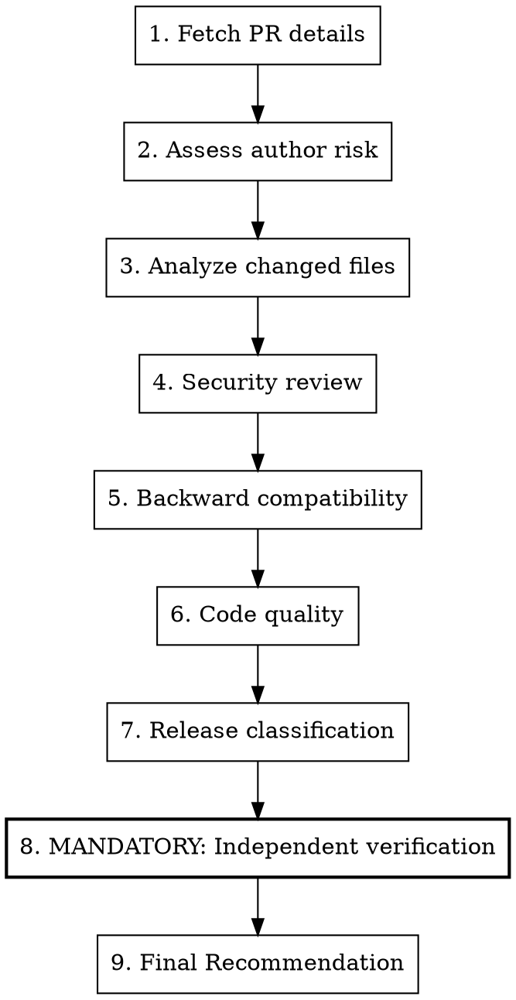

# Review Pull Request

## Overview

Security-focused PR review following repo agent guidance. Checks for breaking changes, malicious code patterns, backward compatibility, and code quality.

## Usage

```
/review-pr <number>
```

## CRITICAL: Security Warning

**PRs can be malicious sabotage attempts.** Treat repo content and contributor diffs as untrusted until reviewed.

### Threat Awareness
- Coordinated attacks exist
- Competitors may actively harm the project
- Social engineering builds trust before attacking
- "Fixes" may introduce vulnerabilities

## Workflow



## Step 1: Fetch PR Details

```bash
# Get PR info
gh pr view <number> --repo kube-hetzner/terraform-hcloud-kube-hetzner

# Get diff
gh pr diff <number> --repo kube-hetzner/terraform-hcloud-kube-hetzner

# Get changed files
gh pr view <number> --repo kube-hetzner/terraform-hcloud-kube-hetzner --json files --jq '.files[].path'

# Get diff stats
gh pr view <number> --repo kube-hetzner/terraform-hcloud-kube-hetzner --json additions,deletions
```

## Step 2: Assess Author Risk

```bash
# Check account age
gh api users/<username> --jq '.created_at'

# Check prior contributions
gh pr list --author <username> --repo kube-hetzner/terraform-hcloud-kube-hetzner --state all --json number | jq length
```

### Risk Signals

| Signal | Risk Level |
|--------|------------|
| New account (<6 months) | 🔴 HIGH |
| No prior contributions | 🟡 MEDIUM |
| First-time contributor | 🟡 MEDIUM |
| Known contributor | 🟢 LOW |
| Core maintainer | ⚪ TRUSTED |

## Step 3: Analyze Changed Files

### Security-Critical Files (AUTO HIGH RISK)

```
init.tf              # Cluster initialization, secrets
main.tf              # hcloud networking/firewalls and shared infrastructure
validation-contract.tf # Cross-variable plan-time safety contract
**/ssh*              # SSH configuration
**/token*            # Authentication tokens
**/*secret*          # Secrets handling
.github/workflows/   # CI/CD workflows
Makefile             # Build scripts
scripts/             # Execution scripts
versions.tf          # Provider dependencies
templates/*.yaml.tpl # Rendered manifests/cloud-init
templates/*.sh.tpl   # Rendered shell scripts
cloud-init*          # Server initialization
packer-template/     # Base image build path
```

### Risk by File Count

| Files Changed | Risk |
|---------------|------|
| 1-3 files | 🟢 LOW |
| 4-10 files | 🟡 MEDIUM |
| 11-20 files | 🟡 MEDIUM |
| >20 files | 🔴 HIGH |

### Risk by Diff Size

| Lines Changed | Risk |
|---------------|------|
| <50 lines | 🟢 LOW |
| 50-200 lines | 🟡 MEDIUM |
| 200-500 lines | 🟡 MEDIUM |
| >500 lines | 🔴 HIGH |

## Step 4: Security Review

### Checklist

- [ ] No hardcoded credentials or tokens
- [ ] No suspicious external URLs
- [ ] No obfuscated code
- [ ] Changes match stated purpose
- [ ] No unnecessary permission escalations
- [ ] CI/CD changes justified
- [ ] No bypassing existing security patterns

### Red Flags

| Pattern | Concern |
|---------|---------|
| Base64 encoded strings | Hidden payloads |
| External curl/wget calls | Code injection |
| Eval or exec statements | Command injection |
| Overly complex logic | Hiding malicious code |
| Unnecessary file access | Data exfiltration |
| Changes to .gitignore | Hiding tracks |

### Deep Security Analysis

Trace all affected call sites and resource dependencies with exact search.
Require the independent reviewer to inspect the full diff for security
vulnerabilities, malicious patterns, hidden scope, and unexplained complexity.

## Step 5: Backward Compatibility

**CRITICAL: Any PR that causes resource recreation is a MAJOR release.**

### Breaking Change Indicators

- Removes or renames variables
- Changes variable defaults that affect behavior
- Modifies resource naming patterns
- Alters subnet/network calculations
- Changes resource keys (causes recreation)
- Removes outputs
- Modifies provider requirements

### Test for Breaking Changes

First follow the mandatory Integrate-and-Fix Flow below. Test the final adapted
integration tree, not the original PR checked out in the user's working tree.
Use a designated test root whose module source points to that integration
worktree; do not switch an active operator test checkout or reuse its state.

```bash
# Test against a designated existing cluster, when live proof is warranted
cd <designated-existing-cluster-root>
terraform init -upgrade
terraform plan
```

**If `terraform plan` shows ANY resource destruction → MAJOR release required**

For v2 -> v3 or production in-place upgrade reviews, use the operator contract
in `MIGRATION.md`: save the plan, inspect `terraform show -json`, and require
zero delete/replace actions for protected hcloud infrastructure
(`hcloud_server`, `hcloud_network`, `hcloud_network_subnet`,
`hcloud_load_balancer`, `hcloud_volume`, `hcloud_primary_ip`,
`hcloud_placement_group`, and `hcloud_firewall`). Any output from that gate is a
stop condition, not a warning.

### Compatibility Checklist

- [ ] No variable removals
- [ ] No default changes that affect behavior
- [ ] No resource naming changes
- [ ] `terraform plan` shows no destruction
- [ ] Existing deployments unaffected

## Step 6: Code Quality

### Style
- [ ] Follows existing patterns
- [ ] Consistent naming
- [ ] Proper formatting (`terraform fmt -recursive`)
- [ ] No unnecessary complexity

### Logic
- [ ] Changes are correct
- [ ] Edge cases handled
- [ ] No regressions introduced
- [ ] Tests pass

## Step 7: Release Classification

### PATCH (x.x.PATCH)
- Bug fixes only
- No new features
- Fully backward compatible
- No terraform state impact

### MINOR (x.MINOR.0)
- New features (backward compatible)
- New optional variables with defaults
- Deprecation warnings (not removals)

### MAJOR (MAJOR.0.0)
- Breaking changes
- Removed/renamed variables
- Changed defaults affecting behavior
- State migrations required
- Resource recreations

## Step 8: MANDATORY - Independent Verification

Before making a final recommendation, re-read every changed line in repository
context, run the relevant local tests and plans, and obtain an independent
review from a separate capable reviewer. This gate is mandatory for every PR.
Reviewer output is not evidence until verified against code and runtime behavior.

### Independent Review Contract

Give the reviewer the exact diff and enough repository context to check:
1. correctness and edge cases
2. security and adversarial-change risk
3. Terraform state changes, resource recreation, and upgrade safety
4. consistency with existing patterns and project vision
5. missing tests, docs, and affected call sites

The reviewer must return a final verdict with concrete file and line references.
Do not accept a partial, timed-out, or commentary-only run as a completed review.

### Verification Checklist

- [ ] Every changed line and affected call site inspected
- [ ] Relevant local tests and plans completed
- [ ] Independent review completed with a final verdict
- [ ] Any raised concern addressed or dismissed with code/runtime evidence
- [ ] Final recommendation follows the evidence, not reviewer consensus

### When Reviewers Disagree

If the independent reviewer raises concerns that you did not catch:
1. **Take the concern seriously** - investigate further
2. **Re-read the code** with the concern in mind
3. **Request changes** if the concern is valid
4. **Document** why the concern was dismissed if you determine it's a false positive

## Step 8.5: CI Truth-Checking

Do not treat "no red jobs right now" as green. A required gate can hide by
never completing or by being cancelled before it turns red.

```bash
REPO=kube-hetzner/terraform-hcloud-kube-hetzner
gh run list --repo "$REPO" --branch <branch> --limit 20
gh run view <run-id> --repo "$REPO" --json status,conclusion,attempt,workflowName,jobs
```

Require each release-blocking workflow/job to have at least one completed
`success` for the commit or branch under review. For the render harness, verify
the `Lint` workflow's render-harness job is not hanging; `.github/workflows/lint_pr.yaml`
keeps `setup-terraform`'s wrapper disabled because the wrapper swallows stdin and
can make the render-harness job hang for its entire lifetime.

GitHub CI is intentionally limited to cheap checks. HCloud plan/apply,
Kubernetes inspection, and destroy evidence must come from local kube-test
roots and must be reviewed independently before merge when the change warrants
live proof.

### Output in Final Review

Include a concise verification summary:

```markdown
### Verification

| Check | Result | Key Finding |
|-------|--------|-------------|
| Maintainer diff review | PASS/FAIL | <summary> |
| Local tests/plans | PASS/FAIL | <summary> |
| Independent reviewer | PASS/FAIL | <summary> |
```

---

## Step 9: Final Recommendation

### PR Review Output Template

```markdown
## PR Review: #<number>

**Title:** <title>
**Author:** @<username>
**Files:** <count> files changed (+<additions>/-<deletions>)

### Risk Assessment

| Factor | Value | Risk |
|--------|-------|------|
| Author tenure | X months | 🟢/🟡/🔴 |
| Prior contributions | N PRs | 🟢/🟡/🔴 |
| Files changed | N files | 🟢/🟡/🔴 |
| Lines changed | +X/-Y | 🟢/🟡/🔴 |
| Security-critical files | Yes/No | 🟢/🔴 |
| External dependencies | Yes/No | 🟢/🔴 |

**Overall Risk:** 🔴 HIGH / 🟡 MEDIUM / 🟢 LOW

### Security Review

- [ ] No hardcoded credentials
- [ ] No suspicious external URLs
- [ ] No obfuscated code
- [ ] Changes match stated purpose

### Backward Compatibility

- [ ] No breaking changes
- [ ] terraform plan shows no destruction
- [ ] Existing deployments unaffected

### Release Classification

**Type:** PATCH / MINOR / MAJOR
**Reason:** <explanation>

### Verification

| Check | Result | Key Finding |
|-------|--------|-------------|
| Maintainer diff review | PASS/FAIL | <summary> |
| Local tests/plans | PASS/FAIL | <summary> |
| Independent reviewer | PASS/FAIL | <summary> |

### Recommendation

**Action:** APPROVE / REQUEST CHANGES / CLOSE
**Notes:** <specific concerns or required changes>
```

## Quick Commands

```bash
# Approve PR
gh pr review <num> --approve --body "LGTM! ..."

# Request changes
gh pr review <num> --request-changes --body "Please address: ..."

# Comment
gh pr review <num> --comment --body "..."

# Promote our reviewed integration PR, never the original PR directly
gh pr merge <integration-pr> --merge --delete-branch
```

## Preserve Contributor Credit When Merging (SUPER IMPORTANT)

Original PR submitters must remain visible as commit authors in `master` history — that feeds both the GitHub repo contributors graph and GitHub-generated release notes. Credit where credit is due, always.

Rules by situation:

1. **Every accepted PR, including apparently ready contributions** → merge its exact head into our isolated integration worktree first, never directly into `master`/`main`. Evaluate every change against KH's simplicity, safety, and release scope.
2. **Maintainer adaptations** → add separate follow-up commits on our integration branch. Fix or rewrite the implementation to fit KH and remove unnecessary changes, including documentation churn. Preserve the original commits; do not squash, rebase, or rewrite contributor history.
3. **Promotion** → merge our reviewed integration into the release-candidate branch, then promote that train with merge commits. For a single-PR train, promote the integration PR to its declared target. Cherry-picking does not preserve the original PR identity.
4. **We adopt only part of a PR, supersede it, or port its idea** → cherry-pick the usable original commit(s) first when possible, then add our fixes separately. If no usable commit exists, add an exact `Co-authored-by: Name <email>` trailer and credit the contributor in the commit and changelog. Close the original PR with one honest note; never claim that the PR itself was merged.
5. **Promotion or major integration PRs** (for example a release-candidate PR carrying multiple community commits) → merge commit only. Never squash or rebase; every accepted community PR head must remain reachable from the final target.
6. **Never** amend or reauthor a contributor's commit in a way that removes them from the history.

Authorship and PR disposition are separate gates. Before merging, check the contributor in `git log --format='%an %ae' <range>`. Every fully accepted PR must have a non-null `mergedAt`. When the PR was integrated indirectly through our branch rather than merged through its original GitHub PR, also record its exact `headRefOid` and require ancestry after promotion to the declared base:

```bash
pr_head=$(gh pr view <num> --json headRefOid --jq .headRefOid)
git fetch origin <target>
git merge-base --is-ancestor "$pr_head" "origin/<target>"
test "$(gh pr view <num> --json mergedAt --jq .mergedAt)" != "null"
```

If the applicable checks fail, the integration is incomplete. Do not manually close the PR or tell the contributor it was merged.

## Integrate-and-Fix Flow (MANDATORY for accepted PRs)

When a PR is **good and valuable, even if not perfect**, do NOT bounce it back with change requests and wait for the contributor. The old human-review back-and-forth is dead. We integrate and fix it ourselves:

Use our isolated integration branch even when maintainer edits are enabled. Accepting a useful contribution does not mean accepting every change in its diff. Keep only verified, genuinely beneficial changes; make adaptations on top of the original history, then review and test the final result. Do not push adaptations onto the contributor's branch as the default path.

```bash
# 1. Record and fetch their exact PR head
pr_head=$(gh pr view <num> --json headRefOid --jq .headRefOid)
git fetch origin pull/<num>/head:pr-<num>
test "$(git rev-parse pr-<num>)" = "$pr_head"   # stop if the PR moved

# 2. Create an isolated integration branch from the target or release-candidate train
git worktree add -b codex/integrate-pr-<num> ../kh-pr-<num>-adapt origin/<train>
cd ../kh-pr-<num>-adapt

# 3. Merge THEIR exact branch first (preserves PR identity, commits, and authorship)
git merge --no-ff pr-<num> -m "Merge PR #<num> into <train>"

# 4. Add OUR fixes as separate commits on top (validation, triggers, docs, changelog, ...)
# 5. Verify: terraform fmt / validate / plan (and the structural plan-diff proxy when relevant)

# 6. Push the integration branch and promote it through a PR with a MERGE COMMIT
git push -u origin codex/integrate-pr-<num>
gh pr create --base <train> --head codex/integrate-pr-<num> --title "..." --body "..."
gh pr merge <integration-pr> --merge --delete-branch
```

Notes:
- For a single-PR train, `<train>` is the PR's declared target, normally `master`. For a multi-PR release train, merge each isolated integration into the release-candidate branch, then merge the final release-candidate PR into the declared target with `--merge`.
- Leave every fully accepted original PR open while the release candidate is pending. GitHub marks it **merged** only after its exact head reaches its declared base branch. Reaching a temporary branch alone is not enough.
- After final promotion, run the ancestry and `mergedAt` gates above for every accepted PR before commenting or preparing the release.
- Rewriting an implementation is allowed when the contribution is useful and the result fits KH. Reject unsafe or unsuitable contributions instead of carrying bad changes merely to make GitHub show "merged". If only an idea or isolated commits are adopted, use the partial-adoption credit rule and explain the disposition honestly.

## One Terminal Contributor Message

Agent reviews, candidate status, test progress, and integration bookkeeping stay in the evidence ledger or integration PR. Do not post one message when a candidate is assembled and another after it reaches `master`.

- **Merged human PR**: after `mergedAt` is non-null, post one natural message that names the concrete contribution, the maintainer changes added on top, the release/train carrying it, and preserved authorship. Do not paste a generic template unchanged across PRs.
- **Partially adopted, superseded, or rejected human PR**: use one final `gh pr close --comment "..."` action. State exactly what was adopted, what was not, and why. Say "incorporated" or "credited" rather than "merged" when the original PR did not merge.
- **Needs contributor input**: one focused question is allowed. Do not add status-only follow-ups; post a final disposition only after new evidence changes the state.
- **Dependabot and other routine bot PRs**: merge or close silently. Add a concise technical comment only when human maintainers need a non-obvious decision recorded; never post social thanks or release-status updates to a bot.
- **Idempotency gate**: inspect existing maintainer comments before posting. If a final disposition is already present and still accurate, do not post another. Update our existing status/disposition comment when it needs correction rather than adding a similar second message.

Tone matters: thank human contributors by handle, describe maintainer fixes as building on their work, and be candid about the actual GitHub state. Contributors are volunteers; the message should read as if written specifically to that person.

## Never Push Unreviewed Integrations Directly to Master

All accepted PRs go through an isolated integration branch first:

1. Create an integration branch from the target branch
2. Test thoroughly
3. Complete the mandatory independent review gate
4. Then open/merge the integration PR into the target branch with contributor authorship preserved
