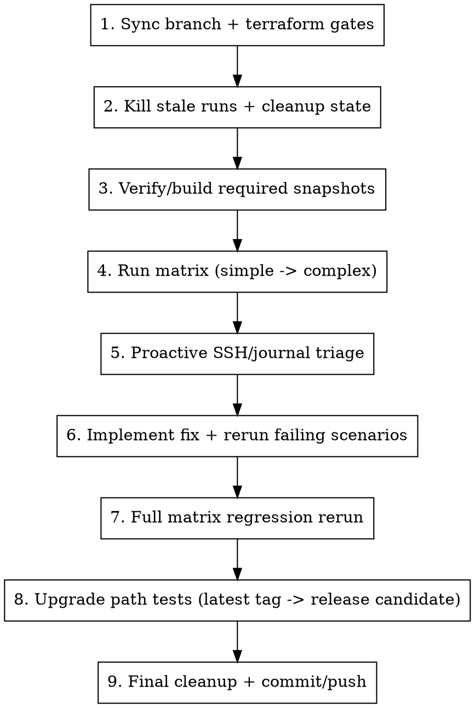

# Running Stabilization Loop

## Overview

Use this workflow when the goal is not only to detect failures, but to fix them and prove full regression safety after major changes.

## Usage

```bash
/running-stabilization-loop
```

## Buddy Prompt Template

Use this exact prompt when delegating the loop to another agent:

```text
Run the full kube-hetzner v3 stabilization loop end-to-end, do not stop at pass/fail reporting.

Goals:
1) Make every matrix scenario pass from simple to complex.
2) Fix root causes in kube-hetzner (not workarounds in test harness) unless explicitly required.
3) Re-run full matrix after fixes to prove no regressions.
4) Validate upgrade path from latest git tag to the current release-candidate branch for both k3s and rke2.
5) When Tailscale credentials are available, include the Tailscale node-transport
   scenarios: secure single-network Tailnet access, plus Flannel with multiple
   Hetzner Networks, route auto-approval, autoscaler scale-up/down,
   `tailscale status`, and cross-network pod traffic.
6) Include final v3 polish scenarios when touched: Cilium Gateway API with
   `enable_kube_proxy=false`, embedded registry mirror on k3s or RKE2, endpoint
   output sanity, and example validation.

Hard requirements:
- Use /Users/karim/.ssh/id_ed25519 with IdentitiesOnly=yes for all SSH.
- Use /Volumes/MysticalTech/Code/kube-test/run_v3_matrix.sh and summary-*.md as source of truth.
- If RKE2/K3s apply hangs, SSH during apply and inspect journalctl/cloud-init immediately.
- If destroy hangs, run cleanup and delete stuck autoscaled servers via hcloud.
- Keep changes minimal and production-safe; run Terraform and OpenTofu validation before each rerun.
- For Tailscale node transport, verify single-network clusters work without
  route approval when route advertisement is disabled; for multinetwork, verify
  node-private routes are approved and SNAT is disabled for advertised routes.
  Do not mistake external overlay SSH access for supported Kubernetes node
  transport.
- For Cilium Gateway API, verify GatewayClass exists, Gateway is accepted, and
  HTTPRoute serves through the Hetzner LoadBalancer. For embedded registry
  mirror, verify `registries.yaml`, `embedded-registry: true`, peer ports, and
  image-pull behavior.

Deliverables:
- Final scenario matrix results with log paths.
- List of fixes made with files changed.
- Upgrade test result (tag -> release-candidate branch) and any required migration notes.
- Confirmation cleanup is complete and no khv3-* resources are left.
```

## Test Environment

- Module code: `/Volumes/MysticalTech/Code/kube-hetzner`
- Test harness: `/Volumes/MysticalTech/Code/kube-test`
- Matrix runner: `/Volumes/MysticalTech/Code/kube-test/run_v3_matrix.sh`
- SSH key (required): `/Users/karim/.ssh/id_ed25519`

## Invariants

1. Always use `-o IdentitiesOnly=yes -i /Users/karim/.ssh/id_ed25519` for SSH.
2. Always start from a clean scenario state before new loops.
3. If any matrix scenario fails, debug and fix it before continuing.
4. After targeted fixes, rerun the full matrix to guard against regressions.
5. For destroy hangs with autoscaler/LB leftovers, use cleanup and `hcloud` deletes.
6. Do not keep temporary broad firewall overrides after root cause is fixed.
7. Treat `scenarios_v3/summary-*.md` + scenario `logs/*.log` as canonical run evidence.

## Workflow



## Step 1: Sync Branch and Run Gates

```bash
cd /Volumes/MysticalTech/Code/kube-hetzner
git pull --ff-only origin "$(git branch --show-current)"
terraform fmt -recursive
terraform init -backend=false
terraform validate
tmpdir="$(mktemp -d)"
rsync -a --exclude .git --exclude .terraform --exclude .terraform-tofu ./ "$tmpdir"/
(cd "$tmpdir" && tofu init -backend=false && tofu validate)
rm -rf "$tmpdir"

cd /Volumes/MysticalTech/Code/kube-test
terraform init -upgrade
```

## Step 2: Kill Stale Runs and Clean State

```bash
pkill -f run_v3_matrix.sh || true
pkill -f "terraform -chdir=/Volumes/MysticalTech/Code/kube-test/scenarios_v3" || true
```

Destroy all scenarios:

```bash
for d in \
  s1-k3s-basic \
  s2-rke2-basic \
  s3-k3s-autoscaler \
  s4-rke2-autoscaler \
  s5-leapmultiarch \
  s6-mixed-os \
  s7-kubeapi-join-lb
do
  terraform -chdir="/Volumes/MysticalTech/Code/kube-test/scenarios_v3/$d" destroy -auto-approve || true
done
find /Volumes/MysticalTech/Code/kube-test/scenarios_v3 -name ".terraform.tfstate.lock.info" -delete
```

If resources are stuck (especially autoscaler nodes), run:

```bash
cd /Volumes/MysticalTech/Code/kube-test
/Volumes/MysticalTech/Code/kube-hetzner/scripts/cleanup.sh --dry-run
/Volumes/MysticalTech/Code/kube-hetzner/scripts/cleanup.sh --execute
```

The force cleanup treats the Terraform token's entire HCloud project as
cluster-dedicated. Inspect every dry-run row before the typed confirmation and
include volumes, snapshots, DNS zones, or Storage Boxes only deliberately.

Optional alias:

```bash
alias cleanupkh='/Volumes/MysticalTech/Code/kube-hetzner/scripts/cleanup.sh'
```

## Step 3: Verify Snapshot Prerequisites

Expected snapshots:
- Leap Micro: `k3s x86`, `k3s arm`, `rke2 x86`, `rke2 arm` (4 total)
- MicroOS: `k3s x86`, `k3s arm`, `rke2 x86`, `rke2 arm` (4 total,
  required when the release touches the legacy image path or mixed-os scenarios)

Check:

```bash
hcloud image list --type snapshot -o columns=id,name,architecture,labels
```

Create missing ones from a fresh, manifest-verified generated bundle. Keep the
token already exported in the environment; do not parse or print it:

```bash
repo_root=/Volumes/MysticalTech/Code/kube-hetzner
build_root="$(mktemp -d)"
KH_SOURCE_DIRECTORY="$repo_root" folder_name=generated \
  folder_path="$build_root" create_snapshots=none \
  "$repo_root/scripts/create.sh"
cd "$build_root/generated/packer"
./scripts/install-verified-packer-plugin-hcloud.sh
for template in hcloud-leapmicro-snapshots.pkr.hcl hcloud-microos-snapshots.pkr.hcl; do
  packer init "$template"
  for distro in k3s rke2; do
    packer build -var "selinux_package_to_install=${distro}" "$template"
  done
done
```

For a release canary, set `KH_SOURCE_DIRECTORY` to the exact release checkout or
an extracted archive of that release. Record the generated bundle's manifest
digest, snapshot IDs, architectures, and distro labels before any cluster
apply. Never build from loose templates copied into `kube-test`.

## Step 4: Run Matrix (Simple to Complex)

Run full matrix:

```bash
cd /Volumes/MysticalTech/Code/kube-test
RUN_ID="$(date +%Y%m%d-%H%M%S)" ./run_v3_matrix.sh | tee "scenarios_v3/matrix-${RUN_ID}.log"
```

Run targeted scenarios:

```bash
cd /Volumes/MysticalTech/Code/kube-test
RUN_ID="$(date +%Y%m%d-%H%M%S)" SCENARIOS="s2-rke2-basic s4-rke2-autoscaler" ./run_v3_matrix.sh
```

## Step 5: Proactive Debugging During Runs

Do not wait for timeout-only diagnosis. SSH while apply is running if progress stalls.

Find nodes:

```bash
hcloud server list -o columns=id,name,status,ipv4 | grep khv3-
```

SSH:

```bash
ssh -i /Users/karim/.ssh/id_ed25519 \
  -o IdentitiesOnly=yes \
  -o StrictHostKeyChecking=no \
  -o UserKnownHostsFile=/dev/null \
  root@<node-ip>
```

Core checks:

```bash
systemctl is-system-running
cloud-init status --long || true
journalctl -u cloud-init -u cloud-config -u sshd --no-pager -n 200
journalctl -u k3s -u k3s-agent -u rke2-server -u rke2-agent --no-pager -n 300
```

RKE2-specific checks:

```bash
ls -lah /etc/rancher/rke2
cat /etc/rancher/rke2/config.yaml
systemctl cat rke2-server
systemctl cat rke2-agent
```

If terraform-installed scripts fail, run the exact failing commands manually and capture output (do not only read terraform stderr).

Known high-frequency failures to check first:

1. Root SSH lock on Leap Micro:
   - Symptom: `User root not allowed because account is locked`
   - Check: `grep '^root:' /etc/shadow`
   - Fix path: packer transactional-update stage, not volatile one-off edits.
2. Firewall/API source mismatch false negatives:
   - Symptom: cluster healthy internally but kubectl/API unreachable from runner.
   - Check runner public source vs `firewall_kube_api_source`.
   - Fix: use explicit allowed source in test-only scenarios, then revert broad overrides.
3. RKE2 config/path issues:
   - Confirm module writes persistent config under `/etc/rancher/rke2`.
   - If a script writes to non-persistent/incorrect paths, fix module scripts and rerun.
4. Stale Leap Micro signing key:
   - Symptom: `transactional-update.service` reports `NOTTRUSTED` packages or
     repository metadata signed by an expired `35A2F86E29B700A4` key.
   - Check: `rpm -q openSUSE-build-key gpg-pubkey-29b700a4-6a17fa38`.
   - Fix path: rebuild the Leap Micro snapshot from the current authenticated
     openSUSE appliance. Never use `--no-gpg-checks`, `gpgcheck=0`,
     `rpm --nosignature`, or an equivalent bypass.

### Leap Micro OS update release gate

For release candidates that touch snapshots, bootstrap, SSH, SELinux, or OS
updates, keep a disposable cluster after apply and prove the real update path.
Run the agent first, then a control plane:

```bash
transactional-update --no-selfupdate --non-interactive up
```

Require exit status 0, a new default snapshot when updates are available, and
no `NOTTRUSTED`, key-import, RPM-lock, or discarded-snapshot failure. Reboot the
node and verify all of the following before continuing:

```bash
uname -r
rpm -q openSUSE-build-key gpg-pubkey-29b700a4-6a17fa38
systemctl is-active k3s k3s-agent rke2-server rke2-agent 2>/dev/null || true
systemctl --failed
getenforce
sshd -T | grep -E '^(usepam|permitrootlogin|pubkeyauthentication|passwordauthentication|kbdinteractiveauthentication) '
snapper list
```

Also prove that the boot ID changed, the node returned `Ready`, all required
pods recovered, API `/readyz` passes, metrics work, and an in-cluster DNS probe
succeeds. A single-control-plane canary should show brief API downtime; require
full recovery before destroying it. Re-run the checks after every reboot rather
than accepting a successful package transaction as deployment proof.

## Step 6: Fix + Targeted Rerun Loop

1. Implement minimal fix in `/Volumes/MysticalTech/Code/kube-hetzner`.
2. Run gates:

```bash
cd /Volumes/MysticalTech/Code/kube-hetzner
terraform fmt -recursive
terraform init -backend=false
terraform validate
tmpdir="$(mktemp -d)"
rsync -a --exclude .git --exclude .terraform --exclude .terraform-tofu ./ "$tmpdir"/
(cd "$tmpdir" && tofu init -backend=false && tofu validate)
rm -rf "$tmpdir"
```

3. Rerun only failed scenarios:

```bash
cd /Volumes/MysticalTech/Code/kube-test
RUN_ID="$(date +%Y%m%d-%H%M%S)" SCENARIOS="<failed-scenarios>" ./run_v3_matrix.sh
```

Repeat until targeted failures are resolved.

## Step 7: Full Regression Rerun

After targeted failures are fixed, rerun all scenarios:

```bash
cd /Volumes/MysticalTech/Code/kube-test
RUN_ID="$(date +%Y%m%d-%H%M%S)" ./run_v3_matrix.sh
```

No change is done until this full rerun passes.

## Step 8: Upgrade Path Loop (Latest Tag -> Release Candidate)

Build a baseline on latest tag, then upgrade to the current release-candidate code.

```bash
LATEST_TAG="$(git -C /Volumes/MysticalTech/Code/kube-hetzner tag --list 'v*' --sort=-v:refname | head -n1)"
TAG_TREE="/tmp/kube-hetzner-${LATEST_TAG}"
git -C /Volumes/MysticalTech/Code/kube-hetzner worktree add --detach "$TAG_TREE" "$LATEST_TAG"
```

Create an upgrade scenario from a known-good matrix scenario (repeat for both k3s and rke2):

```bash
UPG="/Volumes/MysticalTech/Code/kube-test/scenarios_v3/upgrade-k3s-${LATEST_TAG#v}"
cp -R /Volumes/MysticalTech/Code/kube-test/scenarios_v3/s1-k3s-basic "$UPG"
sed -i '' "s|source    = \"/Volumes/MysticalTech/Code/kube-hetzner\"|source    = \"$TAG_TREE\"|" "$UPG/main.tf"
terraform -chdir="$UPG" init -upgrade
terraform -chdir="$UPG" apply -auto-approve

sed -i '' "s|source    = \"$TAG_TREE\"|source    = \"/Volumes/MysticalTech/Code/kube-hetzner\"|" "$UPG/main.tf"
terraform -chdir="$UPG" init -upgrade
terraform -chdir="$UPG" plan
terraform -chdir="$UPG" apply -auto-approve
terraform -chdir="$UPG" destroy -auto-approve
```

Cleanup worktree:

```bash
git -C /Volumes/MysticalTech/Code/kube-hetzner worktree remove "$TAG_TREE"
```

## Step 9: Finalize

If requested to push the current release-candidate branch:

```bash
cd /Volumes/MysticalTech/Code/kube-hetzner
git status --short
git add -A
git commit -m "fix: stabilize v3 matrix and upgrade loops"
git push origin "$(git branch --show-current)"
```

## Abort/Cleanup Shortcut

```bash
pkill -f run_v3_matrix.sh || true
pkill -f "terraform -chdir=/Volumes/MysticalTech/Code/kube-test/scenarios_v3" || true
for d in /Volumes/MysticalTech/Code/kube-test/scenarios_v3/s*; do
  terraform -chdir="$d" destroy -auto-approve || true
done
find /Volumes/MysticalTech/Code/kube-test/scenarios_v3 -name ".terraform.tfstate.lock.info" -delete
```
